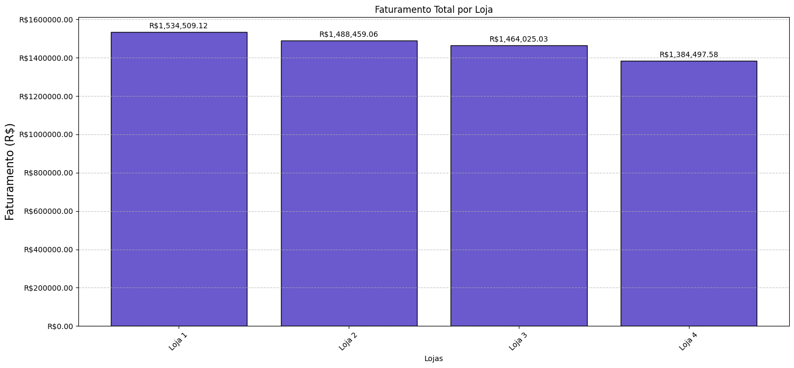
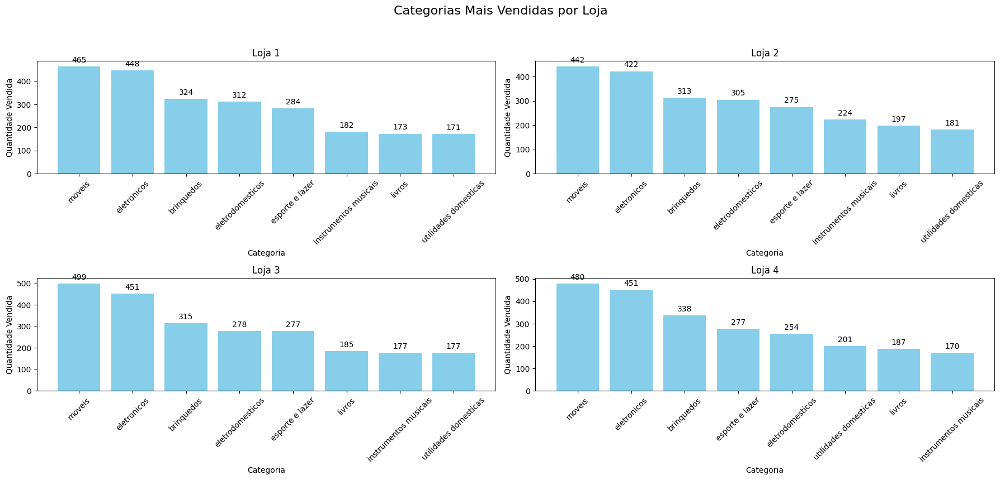
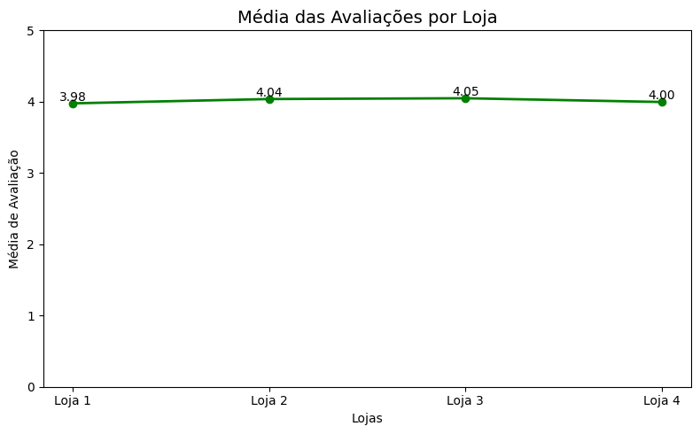
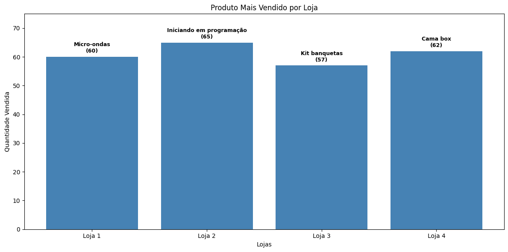
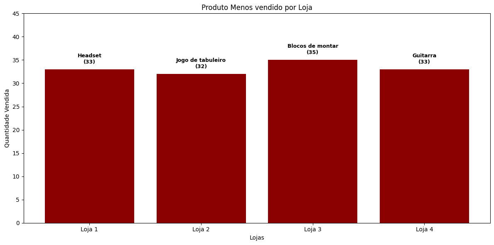
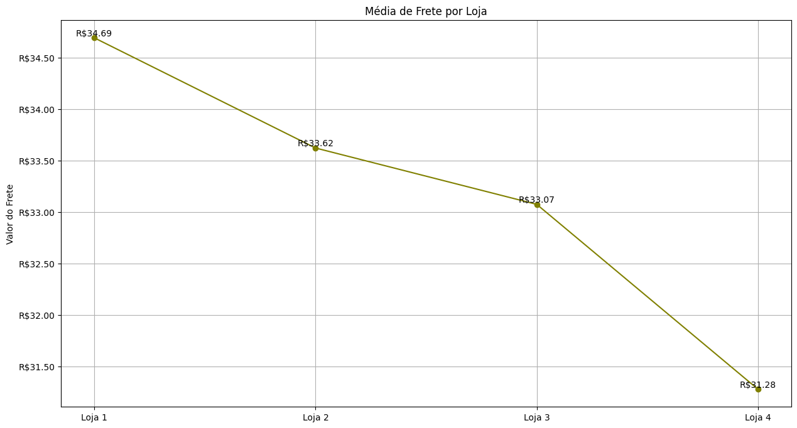
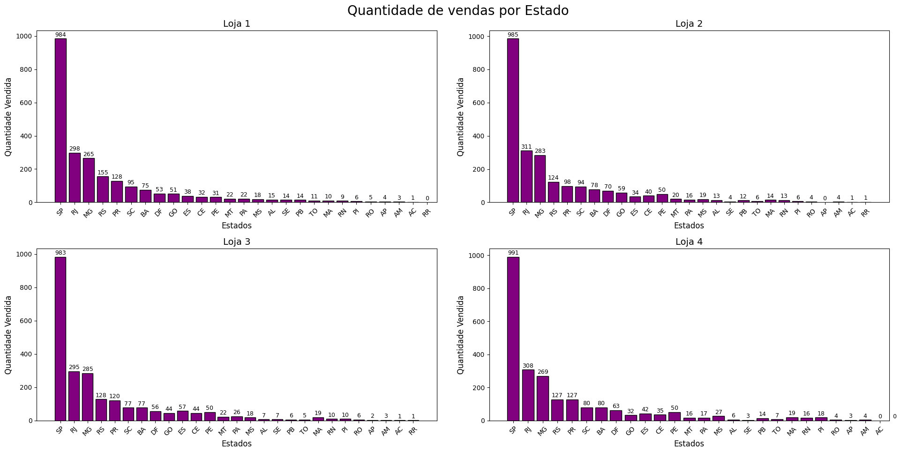
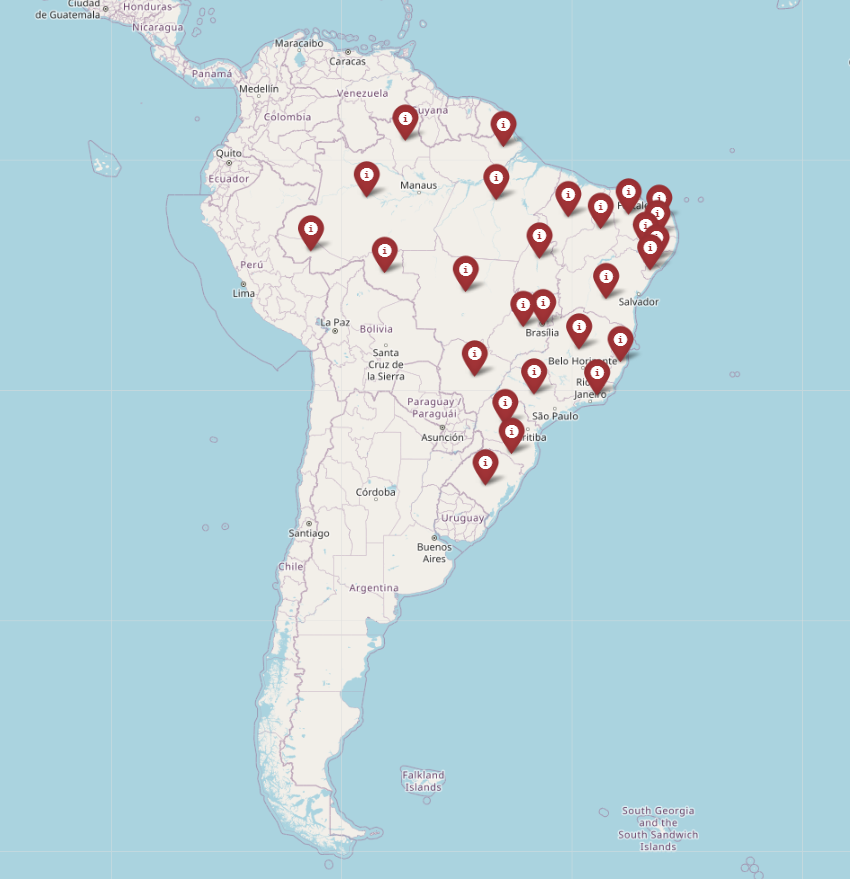

<h1> :bar_chart: Projeto Alura Store - Data Science</h1>

## :round_pushpin: Introdução ao projeto
Challenge proposto pela alura como parte do curso de Modelagem de Dados com Python da Trilha de Data Science. Durante este desafio de Análise exploratória das vendas da Alura Store no Brasil, separadas por loja, cidade e categoria de produtos.
Este projeto utiliza dados simulados de vendas para criar visualizações que ajudam a entender o desempenho de cada loja.
## :books: Linguagem e Bibliotecas uilizadas
* Python
* Pandas
* Matplotlib
* Folium
* Statistics
  
## :notebook_with_decorative_cover: Como utiliza-lo
🚀 Como Utilizar o Projeto

## 1. Clone o repositório ou baixe os arquivos .ipynb
```bash
git clone https://github.com/Gu1lhermeOliveira/Alura-store---Challenge.git
````

## 2. Instale as depedências (caso ainda não tenha)
```bash
pip install pandas matplotlib folium jupyter
````

## 3. Abra o Google colab ou editor de código da sua escolha
```bash
google colab
````

## :dart: Objetivos da analise

* Visualizar o Faturamento de cada loja;
* As Categorias mais vendidas;
* Média das Avaliações dos clientes dividido por loja;
* Produtos mais vendidos;
* Frete médio.

## :bulb: Visualização e insights
### 1. Faturamento Total por loja


### 2. Categorias mais vendidas


### 3. Média de avaliações dos clientes


### 4. Produtos Mais vendidos


### 5. Produto menos vendidos


### 5. Custo do Frete Médio por loja


### 6. Quantidade de Vendas Realizadas por estado


### 7. Mapa Territorial mostrando a presença das lojas do seu João



## ⚠️ Autor do projeto

### Linkedin: www.linkedin.com/in/guilhermedooliveira
